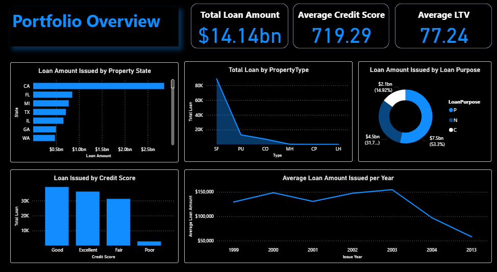
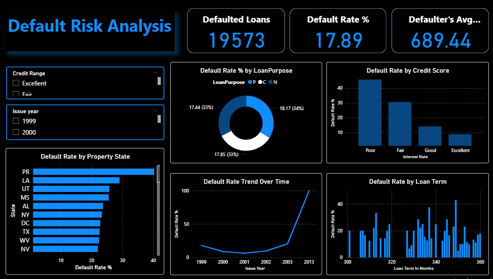
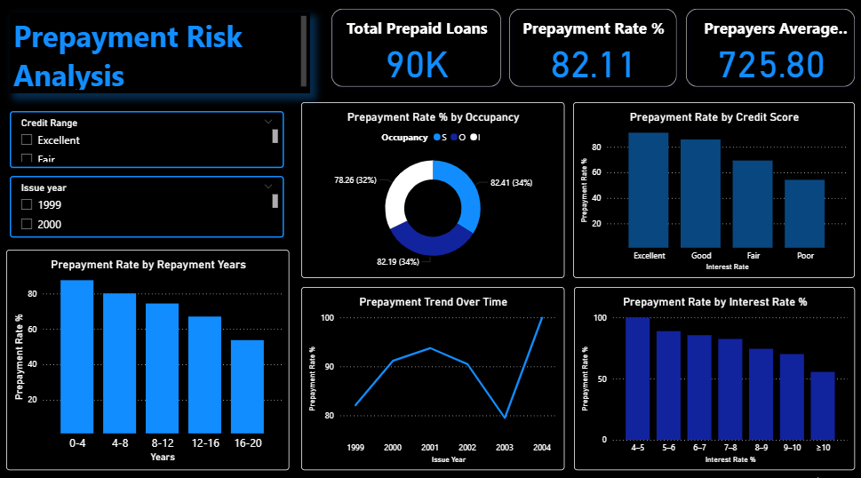

# 📊 Mortgage-Backed Securities Loan Analysis

## 📌 Project Overview  
This project analyzes **Mortgage-Backed Securities (MBS)** loan data to uncover patterns in **portfolio distribution**, **default risk**, and **prepayment factors**.  
Using **SQL** for data exploration and analysis, **DAX** for calculations, and **Power BI** for visualization, it delivers actionable insights for lenders, investors, and financial analysts.

---

## 🔍 Analysis Highlights  

- **Portfolio Overview** – Distribution of loans across states, property types, purposes, and interest rates over time.  
- **Default Risk Analysis** – Identification of high-risk borrower segments based on credit scores, loan purposes, terms, and geographical regions.  
- **Prepayment Risk Analysis** – Key factors influencing early loan repayments, including interest rates and occupancy status.  

---

## 🛠 Tools & Skills Applied  
- **SQL** – Exploratory Data Analysis.  
- **DAX** – Measures and calculated columns for Power BI dashboards.  
- **Power BI** – Interactive dashboards & KPIs for insights visualization.  

---

## 💡 Outcome  
These dashboards provide lenders and investors with a **clear view of portfolio distribution, high-risk areas, and repayment patterns**, enabling **data-driven decision-making** and better **portfolio management**.

---

## 📷 Project Snapshots  

**Portfolio Overview**  
  

**Default Risk Analysis**  
  

**Prepayment Risk Analysis**  
  

---

## 📂 Dataset  
The dataset contains **33 columns** covering borrower demographics, loan details, property characteristics, and repayment history.  
It was sourced from **Freddie Mac’s public mortgage data**.

---

## 🚀 How to View the Dashboard  
1. Download the `.pbix` file from this repository.  
2. Open it in **Power BI Desktop**.  
3. Explore the tabs for different analyses.
